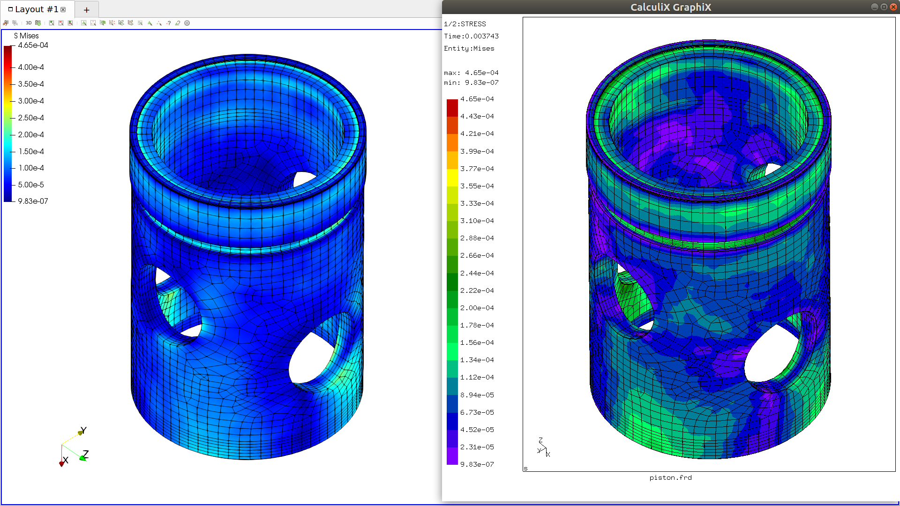

© Ihor Mirzov, August 2019  
Distributed under GNU General Public License v3.0

  

# CalculiX to Paraview converter (frd to vtk/vtu)

Converts [CalculiX](http://www.dhondt.de/) .frd-file to view and postprocess calculation results in [Paraview](https://www.paraview.org/). Generates Mises and Principal components for stress and strain tensors.

The script generates separate file for each output interval - it makes possible to animate time history. **Caution!** If you have 300 time steps in the FRD, there will be 300 VTU files. If you need one file - write output only for one step in you CalculiX model.

I'm testing the script and trying to reduce processing time as much as possible. As for me now it's quite optimized and fast. But Python itself is slower than C/C++. Here we can do nothing, so, for example, [Calmed converter](https://www.salome-platform.org/forum/forum_12/126338563) must be faster - another question is if it's able to convert any model. This script should.
 
  

# Download

Download Linux and Windows binaries from the [releases page](https://github.com/imirzov/ccx2paraview/releases). Binaries don't need to be installed.

  

# How to use

You'll need [Python 3](https://www.python.org/downloads/) with *numpy* to use this converter:

    pip3 install numpy

The main script is [ccx2paraview.py](ccx2paraview.py). Also you'll need:
- [frd2vtk.py](frd2vtk.py)
- [FRDParser.py](FRDParser.py)
- [VTKWriter.py](VTKWriter.py)
- [VTUWriter.py](VTUWriter.py)

It is recommended to convert .frd to modern XML .vtu format:

    python3 ccx2paraview.py jobname.frd vtu

To convert .frd to legacy ASCII .vtk format, use command:

    python3 ccx2paraview.py jobname.frd vtk

Unfortunately, VTK format doesn't support names for field components. So, for stress and strain tensors components will be numbered as:

    0. xx
    1. yy
    2. zz
    3. xy
    4. yz
    5. zx
    6. Mises
    7. Min Principal
    8. Mid Principal
    9. Max Principal

  

# Examples

  

# Your help

Please, you may:

- Simply use this software and ask questions.
- Share your models and screenshots.
- Report problems by [posting issues](https://github.com/imirzov/ccx2paraview/issues).
- Follow discussion in the [Yahoo CalculiX Group](https://groups.yahoo.com/neo/groups/CALCULIX/conversations/topics/13712)

  

# For developers

Converter is tested for all Caclulix examples. Folder [tests](./tests/) contains tests results. Each test contains .inp-task + .frd-calculation + .vtk and .vtu convertion results.

- *./tests/elements* contains tests of mesh conversion
- *./tests/examples* - models are taken directly from [CalculiX examples](http://www.dhondt.de/ccx_2.15.test.tar.bz2)
- *./tests/users* contains files sent by users

Create binary with [pyinstaller](https://www.pyinstaller.org/) (both in Linux and in Windows):

    pip3 install pyinstaller
    pyinstaller ccx2paraview.py --onefile
