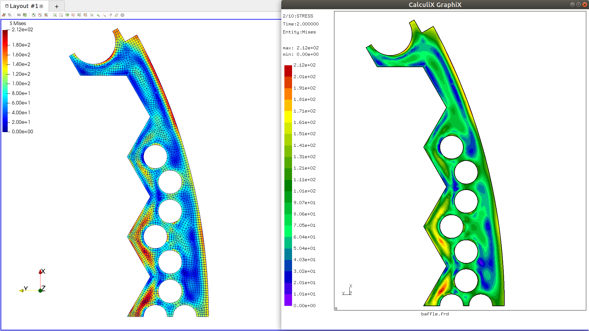

© Ihor Mirzov, January 2020  
Distributed under GNU General Public License v3.0

  

---

[Downloads](#downloads) |
[How to use](#how-to-use) |
[Screenshots](#screenshots) |
[Your help](#your-help) |
[For developers](#for-developers)

---

  

# CalculiX to Paraview converter (frd to vtk/vtu)

Converts [CalculiX](http://www.dhondt.de/) .frd-file to view and postprocess analysis results in [Paraview](https://www.paraview.org/). Generates Mises and Principal components for stress and strain tensors.

The script generates separate file for each output interval - it makes possible to animate time history. **Caution!** If you have 300 time steps in the FRD, there will be 300 VTU files. If you need one file - write output only for one step in you CalculiX model.

I'm testing the script and trying to reduce processing time as much as possible. As for me now it's quite optimized and fast. But Python itself is slower than C/C++. Here we can do nothing, so, for example, [Calmed converter](https://www.salome-platform.org/forum/forum_12/126338563) must be faster - another question is if it's able to convert any model. This script should.

**ccx2paraview** is tested for all CalculiX examples. Folder [tests](./tests/) contains tests results. Each test contains .inp-task + .frd-calculation + .vtk and .vtu convertion results.

  

# Downloads

Download binaries from the [releases page](https://github.com/imirzov/ccx2paraview/releases). Binaries don't need to be installed.

  

# How to use

Run binary with commands:

    in Linux:       ./ccx2paraview jobname.frd vtu
                    ./ccx2paraview jobname.frd vtk
    in Windows:     ccx2paraview.exe jobname.frd vtu
                    ccx2paraview.exe jobname.frd vtk

To run this converter from source you'll need [Python 3](https://www.python.org/downloads/) with *numpy*:

    pip3 install numpy

The main script is [ccx2paraview.py](ccx2paraview.py). It is recommended to convert .frd to modern XML .vtu format:

    python3 ccx2paraview.py jobname.frd vtu

If you have more than one time step there will be additional XML file created - the PVD file. Open it in Paraview to read data from all time steps (all VTU files) at ones.

To convert .frd to legacy ASCII .vtk format, use command:

    python3 ccx2paraview.py jobname.frd vtk

Unfortunately, VTK format doesn't support names for field components. So, for stress and strain tensors components will be numbered as:

    0. xx
    1. yy
    2. zz
    3. xy
    4. yz
    5. zx
    6. Mises
    7. Min Principal
    8. Mid Principal
    9. Max Principal

  

# Screenshots

  

# Your help

Please, you may:

- Simply use this software and ask questions.
- Share your models and screenshots.
- Report problems by [posting issues](https://github.com/imirzov/ccx2paraview/issues).

  

# For developers

Create binary with [pyinstaller](https://www.pyinstaller.org/) (both in Linux and in Windows):

    pip3 install pyinstaller
    pyinstaller ccx2paraview.py --onefile
